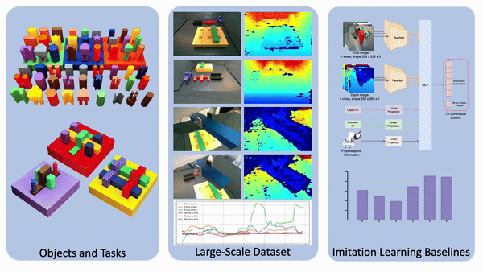

# FMB: A Functional Manipulation Benchmark for Generalizable Robotic Learning



**Webpage: [https://functional-manipulation-benchmark.github.io/index.html](https://functional-manipulation-benchmark.github.io/index.html)**


FMB is a benchmark for robot learning consisting of various manipulation tasks, 22,550 expert demonstrations, and a set of imitation learning baselines. This repo contains the code and instructions to reproduce the benchmark, including robot controller, dataset builder, training and evaluation code for the various imitation learning baselines. 

**Table of Contents**
|Module|Description|
|---|---|
| [Robot Infra](./robot_infra) | For controllering the robot. |
| [Dataset Builder](./fmb_dataset_builder/) | Converting your own RLDS dataset for training. |
| [ResNet-based Policies](./ResNet/) | Training and evaluating ResNet-based policies. |
| [Transformer-based Policies](./Transformer/) | Training and evaluating Transformer-based policies. |
| [Diffusion Policies]() | Training and evaluating Diffusion policies. |

## Example Usage

We demonstrate how to use the FMB codebase to process data, train, and evaluate policies on the real robot. Let's imagine that we want to train a ResNet-based, object-ID conditioned insertion policy.

### 1. Setup
1. Installl each module according to the instructions included. For this example, we will need:
- [Robot Infra](./robot_infra)
- [Dataset Builder](./fmb_dataset_builder/)
- [ResNet-based Policies](./ResNet/)
2. Setup the workspace accordng to the instructions on the [Setup](https://functional-manipulation-benchmark.github.io/files/index.html) page. 

### 2. Processing Data
For faster dataloading, we will first make a new RLDS dataset that only contains the insertion demonstrations for various shapes.

1. Download the raw (`.npy`) [Single-Object Multi-Stage](https://rail.eecs.berkeley.edu/datasets/fmb/single_object_manipulation.zip) dataset from the [Dataset](https://functional-manipulation-benchmark.github.io/dataset/index.html) page of the FMB website.
2. Create a copy of the `fmb_single_object_dataset` folder inside [Dataset Builder](./fmb_dataset_builder/). Note that this step has been done for you as an example.

    ```bash
    cd fmb_dataset_buildr
    cp fmb_single_object_dataset fmb_single_object_insert_dataset
    ```
3. Rename the necessary fields of the new dataset below. Note that most of these steps has been done for you as an example.
    - Rename `fmb_insert_dataset/fmb_single_object_dataset_dataset_builder.py` to `fmb_single_object_insert_dataset/fmb_single_object_insert_dataset_dataset_builder.py`
    - Rename the class named `FmbSingleObjectDataset` inside the python file into `FmbSingleObjectInsertDataset`
    - Update the version number and release notes inside the class if necessary.
    - Edit the if clause on [fmb_single_object_insert_dataset_datset_builder.py line 173](./fmb_dataset_builder/fmb_single_object_insert_dataset/fmb_single_object_insert_dataset_dataset_builder.py#173) to only add the transition to the dataset if the primitive is "insert". 
    - Change the raw dataset path on [line 394](./fmb_dataset_builder/fmb_single_object_insert_dataset/fmb_single_object_insert_dataset_dataset_builder.py#394) to the path of your raw `.npy` dataset.

4. Process the dataset
    ```bash
    conda activate rlds_env
    ulimit -n 20000
    cd fmb_single_object_insert_dataset
    tfds build --data_dir=<output_path>
    ```


### 3. Training the ResNet-based policy
1. Config the training script for the object-ID conditioned insertion policy in `ResNet/scripts/train.sh` appropiately. The following are commonly used FLAGS configured for this example. The comprehensive list of flags and their explanations can be found in the [ResNet](./ResNet/README.md) page. 
    
    - `--dataset_path="<output_path>"`: Path to the directory containing the RLDS dataset. Should be the same path as the <output_path> used above when processing the data.
    - `--dataset_name="fmb_single_object_insert_dataset:1.0.0"`: Name of the dataset to train on and the version number.
    - `--dataset_image_keys='side_1:wrist_1:wrist_2'`: This is the best set of image observations to use for the insertion task that we found.
    - `--state_keys='tcp_pose:tcp_vel:tcp_force:tcp_torque'`: This is the best set of state observations for the insertion task that we found.
    - `--policy.state_injection='no_xy'`: Exclude the xy translation of the tcp_pose from the observations for better generalization. 
    - `--train_gripper=False`: No need to train the gripper action dimension for the insertion task as the object shoudl always be grasped.
    - `--num_pegs=9`: Train the policy with an one-hot vector of length 9 indicating which hole the policy shoud insert the object into.  
    - `--num_primitives=0`: 0 indicates that no conditioning vector should be used to indicate the primitive since we are only training on insert.
  
2. Train the policy

    ```bash
    conda activate fmb_resnet
    cd ResNet/scripts
    bash train.sh
    ```

### 4. Running the robot infra
```bash
conda activat fmb_robot_infra
cd robot_infra
python franka_server.py --robot_ip=<robot_IP> --gripper_dist=0.09
```

 > If you are running a provided checkpoint, please run `robot_server.py` with the `--force_base_frame` flag. This is because our policies where trained with the force/torque information expressed in the robot's base frame, while the dataset and all future checkpoints should contain the force/torque in the end-effector frame instead.

 >If you are evaluating policies for the multi-object tasks, set `--gripper_dist=0.07`. This opens the gripper to a narrower setting to match the dataset and so the objects can be grasped easier.

### 5. Evaluating the policy
The detailed evaluation protocol for each experiment can be found on the [Evaluation Procedure](https://functional-manipulation-benchmark.github.io/procedure/index.html) page.
1. Config the `rollout_bc.sh` script as below:
    
    - `--load_checkpoint='PATH_TO_CHECKPOINT.pkl'`: Set this to the path of the checkpoint that the training produced.
    - `--model_key='train_state'`: Indicate the use of the latest checkpoint.
    - `--primitive='insert'`: Indicate that we are rolling out an insertion policy. Tells the environment to reset to above the board. 
2. Run the rollout script and record the success rate.
    ```bash
    conda activate fmb_resnet
    cd ResNet/scripts
    bash rollout_bc.sh
    ```


## BibTex
If you found this code useful, consider citing the following paper:
```
@article{luo2024fmb,
  title={FMB: a Functional Manipulation Benchmark for Generalizable Robotic Learning},
  author={Luo, Jianlan and Xu, Charles and Liu, Fangchen and Tan, Liam and Lin, Zipeng and Wu, Jeffrey and Abbeel, Pieter and Levine, Sergey},
  journal={arXiv preprint arXiv:2401.08553},
  year={2024}
}
```
