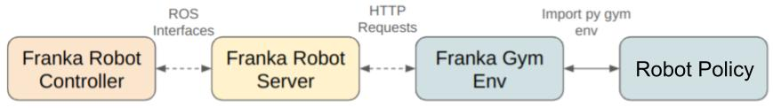

# Robot Infra


The robot infra used to collect the dataset is released as part of the [serl](https://github.com/rail-berkeley/serl/tree/main/serl_robot_infra) project and works for both Franka Emikda Panda and the newer Franka Research 3 arms. 

All robot code is structured as follows:
There is a Flask server which sends commands to the robot via ROS. There is a gym env for the robot which communicates with the Flask server via post requests.

- `robot_server`: hosts a Flask server which sends commands to the robot via ROS
- `franka_env`: gym env for the robot which communicates with the Flask server via post requests


### Prerequisite
- ROS Noetic
- Franka Panda or Franka Research 3 arm and gripper
- `libfranka>=0.8.0` and `franka_ros>=0.8.0` installed according to [Franka FCI Documentation](https://frankaemika.github.io/docs/installation_linux.html)

### Install
```bash
cd robot_infra
conda create -n fmb_robot_infra python=3.9
conda activate fmb_robot_infra
pip install -e .
```
Install the [`serl_franka_controllers`](https://github.com/rail-berkeley/serl_franka_controllers) package.

    sudo apt-get install ros-serl_franka_controllers


Disable the `franka_ros` realtime kernel constraint in `catkin_ws/src/franka_ros/franka_control/config/franka_control_node.yaml` by setting the line:
```yaml
realtime_config: ignore
```

### Usage
1. Launch the robot server, which run the robot controller and a Flask server which streams robot commands to the gym envionrment using HTTP requests. 
    ```bash
    conda activat fmb_robot_infra
    python franka_server.py --robot_ip=<robot_IP> --gripper_dist=<gripper_dist>
    ```
    | Flags | Description |
    | --- | --- |
    | robot_ip | IP of the robot for launching the controller |
    | gripper_dist | Distance the gripper should open to. 0.09 for single-object task, 0.075 for the multi-object task |
    | force_base_frame | Whether to read the end-effector force/torque information in the base frame. Only set this flag if running provided policies. The public FMB dataset expresses force/torque in the end-effector frame. |


    This should start ROS node impedence controller and the HTTP server. You can test that things are running by trying to gently push the end effector around. If the impedence controller is running, it should be compliant.

    The HTTP server is used to communicate between the ROS controller and gym environments. Possible HTTP requests include:

    | Request | Description |
    | --- | --- |
    | startimp | Stop the impedance controller |
    | stopimp | Start the impedance controller |
    | pose | Command robot to go to desired end-effector pose given in base frame (xyz+quaternion) |
    | getpos | Return current end-effector pose in robot base frame (xyz+rpy)|
    | getvel | Return current end-effector velocity in robot base frame |
    | getforce | Return estimated force on end-effector |
    | gettorque | Return estimated torque on end-effector |
    | getq | Return current joint position |
    | getdq | Return current joint velocity |
    | getjacobian | Return current zero-jacobian |
    | getstate | Return all robot states |
    | jointreset | Perform joint reset |
    | get_gripper | Return current gripper position |
    | close_gripper | Close the gripper completely |
    | open_gripper | Open the gripper completely |
    | clearerr | Clear errors |
    | precision_mode | Update the impedance controller parameters to precision mode for resets|
    | compliance_mode | Update the impedance controller parameters to compliance mode for task execution |

    These commands can also be called in terminal. Useful ones include:
    ```bash
    curl -X POST http://127.0.0.1:5000/activate_gripper # Activate gripper
    curl -X POST http://127.0.0.1:5000/close_gripper # Close gripper
    curl -X POST http://127.0.0.1:5000/open_gripper # Open gripper
    curl -X POST http://127.0.0.1:5000/getpos # Print current end-effector pose
    curl -X POST http://127.0.0.1:5000/jointreset # Perform joint reset
    curl -X POST http://127.0.0.1:5000/precision_mode # Change the impedance controller to precision mode
    curl -X POST http://127.0.0.1:5000/compliance_mode # Change the impedance controller to compliance mode
    curl -X POST http://127.0.0.1:5000/stopimp # Stop the impedance controller
    curl -X POST http://127.0.0.1:5000/startimp # Start the impedance controller (**Only run this after stopimp**)
    ```

2. Create an instance of the gym environment in a second terminal.
    ```python
    import gym
    import robot_infra
    env = gym.make("Franka-FMB-v0")
    ```